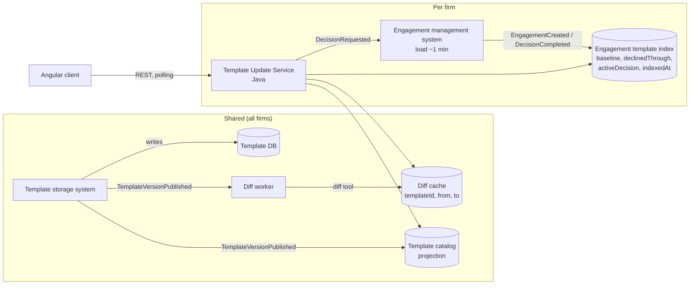

# Design: Pending Template Updates

## 1. High-level architecture

**Core idea.** Loading an engagement costs ~1 minute, so we must never load engagements to answer "what is pending?".
We keep a small per-firm **engagement template index** (engagement → template + baseline version), maintained by hooks,
and a shared **template catalog** (template → published versions). Pending state is then a pure, in-memory comparison
computed **on read**. Summaries are derived from diffs that are shared by all firms.



**Server responsibilities (Template Update Service, Java).**
- Evaluate pending state per engagement from index + catalog (`PendingUpdateEvaluator`). Hundreds of rows × an in-memory
  catalog is microseconds, so there is **no fan-out** to every engagement of every firm when a template is published.
- Build the **human-readable summary** from raw diffs (`ChangeDescriber`, `PendingUpdateSummaryService`).
- Accept decisions with optimistic concurrency, record them as `activeDecision`, and hand them to the engagement system,
  which does the slow load and emits `DecisionCompleted`.
- Represent every "not known yet" state explicitly (`UNKNOWN`, `COMPUTING`, `UNAVAILABLE`) rather than guessing.

**Client responsibilities (Angular).** Presentation and interaction state only: list, selection, review, confirmation,
polling, and reacting to `409`. It never interprets JSON diffs. Implementation based on Clean Architecture and SOLID principles.

**Where the raw diff becomes human-readable: the server.** Reasons: (1) wording needs template vocabulary
(section display names) that lives with the templates, not in the browser; (2) the summary shown when a practitioner
applies is part of a defensible audit trail, so it must be deterministic, versioned and reproducible server-side
(we store a hash of the summary with the decision); (3) one implementation serves every client (web, notifications,
future e-mail digests) and localisation (English/French for Canada) via `Accept-Language`; (4) the rules are unit-tested
in Java against golden diffs from the content team. Trade-off: wording changes require a backend deploy.

**Accumulated updates.** An engagement on v6 with v7 and v8 published has **one** pending update to the latest version.
Apply is all-or-nothing to latest (intermediate versions are not offered: that is what the content team supports).
The summary is the **net** diff baseline → latest, requested directly from the diff tool (so 0.15 → 0.12 → 0.10 reads as
0.15 → 0.10), and each item is annotated with `changedInVersions` using the consecutive diffs. We do not compose diffs
ourselves; the diff tool is the reliable source. **Decline** records `declinedThroughVersion = latest`; the engagement is
pending again only when a newer version is published, and its summary is still computed from the real baseline
(content never moved), with items newer than the declined version highlighted.

**Freshness.** On publish, the catalog projection updates within seconds; the next client poll shows it. Every row carries
`statusAsOf` and responses carry `catalogAsOf`. Polling (60 s, plus on tab focus; 3 s while something is `COMPUTING` or
`IN_PROGRESS`) is enough for ~1 publish/week/product. Push (SSE/WebSocket) is a later optimisation, not a requirement.

## 2. Implementation plan

1. **Hooks & events** (template storage + engagement system): `TemplateVersionPublished`, `EngagementCreated
   {templateId, version}`, `TemplateDecisionCompleted {decision, toVersion}`. AWS: EventBridge → SQS per consumer.
2. **Catalog projection + diff worker** (shared): on publish, upsert catalog; precompute diffs `vK → vNew` for all recent K
   (≤ ~52/year, each quick) into the diff cache (DynamoDB/S3). Unknown pairs are computed lazily (`COMPUTING`).
3. **Engagement template index** (firm DB) + **backfill** job: throttled, parallel, off-hours load of existing engagements
   (hours for hundreds of files). Rows are `UNKNOWN / NOT_YET_INDEXED` until done.
4. **Template Update Service** endpoints (contract below), evaluator, describer, decision command.
5. **Angular** list/detail/decision UI behind a gateway interface (fake first, HTTP later).
6. Rollout behind a feature flag per firm after backfill completes; shadow-compare index vs sampled engagement loads.

## 3. Testing strategy

- **Unit (Java):** evaluator edge cases (up to date, accumulated, not indexed, catalog behind); describer **golden tests**
  (raw diff → expected sentence) curated with the content team; summary service states (READY/COMPUTING/UNAVAILABLE).
- **Consistency check:** for sampled template pairs, the set of paths in `diff(a, c)` equals the net effect of
  `diff(a, b)` + `diff(b, c)`; catches diff-tool or attribution regressions.
- **Contract:** OpenAPI is the source; TS types and Java DTOs are generated and checked in CI (consumer tests on the client).
- **Integration:** event handlers are idempotent and order-tolerant (duplicate/out-of-order publish, decision completed twice).
- **Client:** store tests for `409` stale decisions and polling; component tests that "computing" is never rendered as
  "no changes".
- **E2E (staging):** publish a test template → engagement shows pending within SLA → apply → up to date.

## 4. Evaluation & observability

- **Freshness SLOs:** publish → catalog updated (p95 < 1 min); publish → summaries READY; age of `catalogAsOf`.
- **Correctness:** nightly **reconciliation** samples engagements (slow load) and compares the file's version to the index
  → `index_drift_count`; `UNKNOWN` rows by reason; backfill progress.
- **Summary quality:** % of changes hitting the generic fallback (`itemType = OTHER`) → tells us which template paths need
  wording rules; in-product "Was this summary clear?" feedback; periodic review of summaries with the content team.
- **Decisions:** duration, failure rate, `409` rate (users racing publishes), abandoned `IN_PROGRESS`.
- **AI (if added):** an optional LLM "why this matters" note generated at publish time, reviewed by the content team before
  release, labelled as AI-assisted, evaluated against a golden set. It never produces the before/after values, counts or
  the pending state, which remain deterministic.

## 5. Failure modes & trade-offs

| Failure | Handling |
|---|---|
| Lost / duplicate / out-of-order events | Idempotent upserts keyed by version (keep max); hourly catalog reconciliation against template DB (cheap). |
| Index drift (engagement changed without hook, restore from backup) | Hooks on all version-changing paths; nightly sampling reconciliation; `indexedAt` exposed. |
| Diff not ready / diff tool down | `COMPUTING` / `UNAVAILABLE`; Apply/Decline disabled: we don't let users decide blind. |
| New version published during review | Decision carries `fromVersion/toVersion`; server returns `409`; client refreshes summary. |
| Decision processing fails (1-min load) | `activeDecision.state = FAILED` with reason; retry is idempotent by `(engagementId, toVersion)`. |
| Backfill takes hours | Rows show "not scanned yet", never a wrong "up to date". |
| Unrecognised diff path | Generic but readable fallback + metric; technical path kept for support. |

**Key trade-offs.** Compute-on-read (simple, always consistent, no fan-out) over materialised pending flags (would need
writes to every firm per publish). Polling over push (simpler; adequate for weekly publishes). Server-side summaries
(consistent, auditable) over client-side (more flexible UI iteration). Net summary with attribution over per-version
summaries (matches what Apply does; less reading for users). Blocking decisions without a summary (safer, but an outage
of the diff tool delays decisions).

---

## API contract

All timestamps ISO-8601 UTC. Firm and user come from the auth context. Types match `client/.../template-updates.contract.ts`
and the Java model (`PendingUpdateState`, `ChangeSummary`, `ChangeItem`).

| Method & path | Response |
|---|---|
| `GET /api/engagements/template-updates` | `200 EngagementUpdateListResponse` (supports `ETag` / `304`) |
| `GET /api/engagements/{id}/template-updates/pending` | `200 PendingUpdateDetail` |
| `POST /api/engagements/{id}/template-updates/decisions` | `202 DecisionAccepted` · `409 StaleDecisionProblem` · `422` if summary not READY |

```ts
type UpdateStatus = 'UP_TO_DATE' | 'UPDATE_AVAILABLE' | 'UNKNOWN';
type UnknownReason = 'NOT_YET_INDEXED' | 'TEMPLATE_NOT_IN_CATALOG' | 'CATALOG_BEHIND';

interface PublishedVersion { version: number; publishedAt: string }

interface ActiveDecision {
  decisionId: string; decision: Decision; toVersion: number;
  state: 'IN_PROGRESS' | 'FAILED'; submittedAt: string; failureReason: string | null;
}

interface EngagementUpdateListResponse {
  items: EngagementUpdateStatus[];
  catalogAsOf: string;            // last publish event reflected
  generatedAt: string;
}

interface EngagementUpdateStatus {
  engagementId: string; engagementName: string;
  templateId: string; templateDisplayName: string;
  status: UpdateStatus;
  unknownReason: UnknownReason | null;     // set iff status = UNKNOWN
  currentVersion: number | null;           // null = not known yet (never guessed)
  latestVersion: number | null;
  pendingVersions: PublishedVersion[];     // oldest first; length > 1 = accumulated
  activeDecision: ActiveDecision | null;
  declinedThroughVersion: number | null;
  statusAsOf: string;                      // older of index time and catalogAsOf
}

interface PendingUpdateDetail extends EngagementUpdateStatus {
  summary: ChangeSummary | null;           // null unless UPDATE_AVAILABLE
}

interface ChangeSummary {
  availability: 'READY' | 'COMPUTING' | 'UNAVAILABLE';
  fromVersion: number; toVersion: number;  // baseline -> latest (net)
  items: ChangeItem[];                     // empty unless READY
  computedAt: string | null;
  unavailableReason: string | null;
}

interface ChangeItem {
  changeId: string;
  kind: 'ADDED' | 'MODIFIED' | 'REMOVED';
  itemType: 'QUESTION' | 'CHECKLIST' | 'PROCEDURE' | 'SETTING' | 'TEMPLATE_DETAILS' | 'OTHER';
  area: string;                            // "Materiality"
  title: string;                           // "Threshold percent decreased"
  detail: string | null;
  before: string | null; after: string | null;   // already formatted for display
  changedInVersions: number[];             // empty = attribution unknown
  requiresResponse: boolean;
  technicalPath: string;                   // raw JSON pointer, support only
}

type Decision = 'APPLY' | 'DECLINE';
interface DecisionRequest { decision: Decision; fromVersion: number; toVersion: number }
type DecisionAccepted = ActiveDecision;
interface StaleDecisionProblem { error: 'STALE_UPDATE'; currentVersion: number; latestVersion: number }
```
