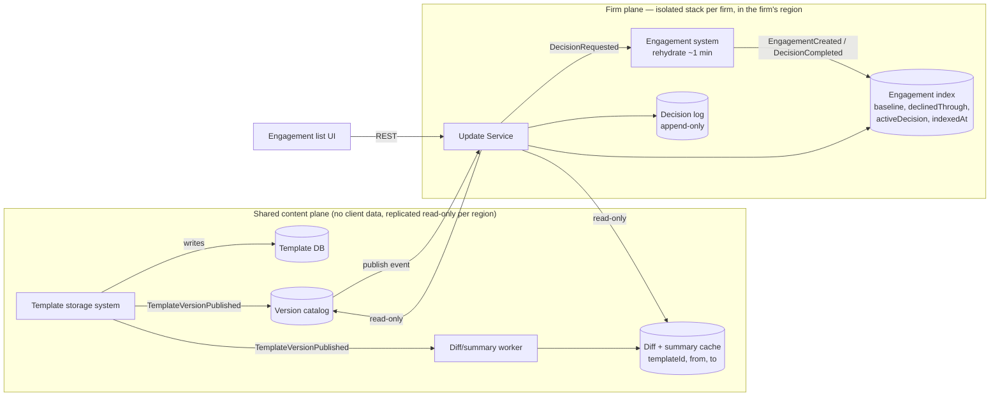

# Design: Pending Template Updates

Users must see at a glance which engagements have pending template updates, and read a human-readable summary of the
inbound changes before applying or declining. The binding constraint is that an engagement's current template version
can only be read by **rehydrating the file (~1 min)**, which can never appear on the read path.

**Core decision.** Keep a small, queryable **projection** of the one fact we need — engagement → template + version —
inside each firm's own data boundary, maintained by events. Pending state is then a **comparison, not a load**:
`latestPublishedVersion > engagementBaselineVersion`. Everything else follows from that.

## 1. Target architecture



**Two planes, one direction of flow.** The content plane holds templates, the version catalog and derived diffs; none of
it is client data, so it can be shared and replicated. The firm plane holds which engagement is on which version, which
_is_ client-confidential. **Data only ever flows content → firm.** No firm identifier, engagement identifier or pending
state is written into the shared template store, preserving the property that it retains nothing about engagement files.

**Read path (no engagement loads).**

- `GET /engagements/template-updates` → the Update Service reads the firm's index (hundreds of rows) plus the in-memory
  catalog and evaluates pending state **on read**. There is no fan-out write when a version is published, so one publish
  affecting every firm costs nothing on the write side.
- `GET /engagements/{id}/template-updates/pending` → the net diff **baseline → latest** from the shared cache, rendered
  as human-readable change items.

**Write path (index maintenance).** Hooks on the engagement system emit `EngagementCreated {templateId, version}` and
`TemplateDecisionCompleted {decision, toVersion}`; the index is upserted from those. Pre-existing engagements are
covered by a **one-off throttled backfill** — the only place we pay the 1-minute load, offline and off the read path.
Until a row is backfilled it reports `UNKNOWN / NOT_YET_INDEXED`: we never guess "up to date".

**Accumulated updates.** An engagement on v6 with v7 and v8 published has **one** pending update, targeting the latest.
The summary is the **net** diff v6 → v8 (so 0.15 → 0.12 → 0.10 reads as 0.15 → 0.10), each item annotated with the
versions that touched it, taken from the consecutive diffs. Apply is all-or-nothing to latest. **Decline** records
`declinedThroughVersion`, so the engagement returns to pending only when something newer is published, and its summary
still starts from the real baseline because the content never moved.

**The human-readable transformation happens server-side**, in the shared worker and Update Service: it needs template
vocabulary (section display names live in the template), it must be deterministic and reproducible for audit ("what did
the practitioner see when they applied?"), it serves every client and locale, and it is unit-testable against golden
diffs. Raw JSON pointers reach the client only as a `technicalPath` used for support.

## 2. Implementation plan

1. **Events**: `TemplateVersionPublished` from the template store; `EngagementCreated` / `TemplateDecisionCompleted`
   from the engagement system (EventBridge → per-consumer SQS, DLQ on each).
2. **Content plane**: catalog projection; diff worker precomputing consecutive pairs plus `vK → vNew` for recent K on
   each publish (≤ ~52/year per product, each quick); any other pair computed lazily and surfaced as `COMPUTING`.
3. **Firm plane**: per-firm index table and decision log; Update Service with the evaluator and summary renderer
   (Part 2 code); decision endpoint with optimistic concurrency.
4. **Backfill** per firm: throttled, resumable, progress exposed; a feature flag enables the firm when it completes.
5. **Observability and alarms** (§4) in place before general availability; shadow-compare the index against sampled
   rehydrations.
6. Roll out firm by firm, smallest first.

## 3. Testing strategy

- **Unit**: evaluator edge cases (up to date, accumulated, not indexed, catalog behind, previously declined);
  **golden tests** for every wording rule (raw diff → expected sentence), curated with the content team; sweep counts.
- **Consistency**: for sampled version pairs, the paths in `diff(a, c)` match the net effect of `diff(a, b) + diff(b, c)`.
- **Contract**: OpenAPI is the source of truth; client types and server DTOs are generated and diffed in CI.
- **Integration**: idempotent, order-tolerant event handling (duplicate publish, out-of-order decisions, replays).
- **Isolation tests as first-class citizens**: automated tests assert that a token scoped to firm A cannot read firm B's
  index or decision log, run against real IAM policies rather than mocks, so isolation is verified structurally.
- **Load**: a publish affecting every firm at once; list latency for the largest firm; backfill concurrency limits.
- **E2E in staging**: publish a template → the firm's list shows it pending within SLA → apply → decision recorded.

## 4. Evaluation & observability

The three operational questions, answered by design:

| Question                                            | Mechanism                                                                                                                                                                                                                                                                                                                                               |
| --------------------------------------------------- | ------------------------------------------------------------------------------------------------------------------------------------------------------------------------------------------------------------------------------------------------------------------------------------------------------------------------------------------------------- |
| **How many engagements does a new version affect?** | On `TemplateVersionPublished`, each firm plane runs a **sweep** over its index (no file loads) emitting `UpdateImpact {firmId, templateId, version, engagementsOnTemplate, affected, unknown}` — see `FirmUpdateSweep` in Part 2. Aggregated across firms, it gives the blast radius of a publish within seconds.                                       |
| **Is the check running for every firm?**            | The sweep's `checkedAt` is a **per-firm heartbeat**. A dashboard lists every active firm with its last successful sweep and its event-consumer lag, and alarms when a firm has no sweep for a published version — a silently stalled tenant is visible without a user reporting it. A synthetic canary firm per region exercises the whole path hourly. |
| **What is a firm's apply/decline history?**         | An append-only **decision log** per firm: `who, when, engagement, from → to, decision, summary hash, outcome`. It is both the audit record and the source of decision metrics (rate, latency, failures).                                                                                                                                                |

Other signals: freshness SLOs (publish → catalog updated, p95 < 1 min; publish → summaries READY); `unknownRatio` per
firm (index gaps); backfill progress; `409` rate (users racing publishes); the **share of changes hitting the generic
wording fallback**, which shows where the human-readable rules need extending; and in-product "was this summary clear?"
feedback. Correctness is guarded by a nightly **reconciliation** that rehydrates a small sample of engagements and
compares their real version against the index, alarming on drift — the only routine use of the slow path.

**On AI.** Pending state and every number in a summary are deterministic. If we add LLM assistance, it is an optional
"why this matters" note generated at publish time, reviewed by the content team before release and labelled as
AI-assisted — never generated per request and never producing values or the apply/decline state, since non-deterministic
text would break the audit trail.

## 5. Security

- **Isolation as a structural property.** Pending-update state lives inside the firm's existing engagement data boundary
  — its own table and stack, in its own account and region — not in a shared table filtered by `firm_id`. Access is
  granted by IAM scoped to that resource (and where a shared table is unavoidable, by `dynamodb:LeadingKeys` conditions
  binding a role to its own partition), so a missing `WHERE` clause cannot leak across firms. Per-firm KMS keys encrypt
  data at rest. Cross-firm access is not merely filtered out, it is unauthorized.
- **Authorization.** The Update Service reuses the engagement system's existing entitlements: a user sees pending updates
  only for engagements they can already open, and only a user permitted to modify an engagement can apply or decline it.
  The feature must not become a backdoor that lists engagements a user cannot otherwise see.
- **Data residency.** The firm plane is deployed in the firm's existing region and its data never leaves it. The content
  plane holds no client data, so it is replicated read-only into each region; residency holds because only
  template-derived, non-confidential artefacts cross regions, and only in that direction.
- **Leakage direction.** Diffs and summaries derive from shared templates and are identical for every firm, so they are
  safe to share. Pending state derives from client data and never leaves the firm plane. Metrics are aggregated per firm
  with identifiers only, never content.

## 6. Failure modes & tradeoffs

| Failure                                                  | Handling                                                                                                                 |
| -------------------------------------------------------- | ------------------------------------------------------------------------------------------------------------------------ |
| Lost / duplicate / out-of-order events                   | Idempotent upserts keyed by version (keep max); DLQ and replay; periodic catalog reconciliation against the template DB. |
| Index drift (restore from backup, a path without a hook) | Nightly sampled-rehydration reconciliation; `indexedAt` surfaced in the contract; drift alarms.                          |
| Diff not ready or diff service down                      | `COMPUTING` / `UNAVAILABLE` are explicit contract states; decisions are blocked rather than made blind.                  |
| New version published mid-review                         | Decisions carry `fromVersion/toVersion`; the server responds `409`; the client re-reads the refreshed summary.           |
| Decision processing fails (the slow path)                | `activeDecision.state = FAILED` with a reason; retry is idempotent per `(engagementId, toVersion)`.                      |
| A publish storms every firm at once                      | Sweeps are queued per firm with jitter and concurrency caps; they are observability-only, so lag never affects the UI.   |
| Backfill incomplete                                      | Rows read `UNKNOWN / NOT_YET_INDEXED` with progress shown — never a false "up to date".                                  |
| Noisy neighbour (a very large firm)                      | Per-firm quotas and isolated stacks; one firm's backfill or sweep cannot starve another.                                 |

**Tradeoffs taken.** Compute-on-read over materialised per-engagement flags: simpler and always consistent, and a publish
touching every firm costs no writes; the price is a slightly heavier read, trivial at hundreds of rows. Per-firm stacks
over a single shared multi-tenant table: stronger isolation and residency, at the cost of more infrastructure to operate.
A net summary over per-version summaries: it matches what Apply does and reads better, with intermediate churn visible
only as version attribution. Blocking decisions without a READY summary: safer, but a diff outage delays users. Polling
(60 s, faster while something is computing) over push: adequate for weekly publishes, with SSE as a later upgrade.

---

## Appendix A: API contract

All timestamps are ISO-8601 UTC; firm and user come from the auth context, never from the request body.

| Method & path                                           | Response                                                                                |
| ------------------------------------------------------- | --------------------------------------------------------------------------------------- |
| `GET /api/engagements/template-updates`                 | `200 EngagementUpdateListResponse` (`ETag` / `304`)                                     |
| `GET /api/engagements/{id}/template-updates/pending`    | `200 PendingUpdateDetail`                                                               |
| `POST /api/engagements/{id}/template-updates/decisions` | `202 DecisionAccepted` · `409 StaleDecisionProblem` · `422` if the summary is not READY |

```ts
type UpdateStatus = "UP_TO_DATE" | "UPDATE_AVAILABLE" | "UNKNOWN";
type UnknownReason =
  | "NOT_YET_INDEXED"
  | "TEMPLATE_NOT_IN_CATALOG"
  | "CATALOG_BEHIND";

interface EngagementUpdateListResponse {
  items: EngagementUpdateStatus[];
  catalogAsOf: string; // last publish event reflected
  generatedAt: string;
}

interface EngagementUpdateStatus {
  engagementId: string;
  engagementName: string;
  templateId: string;
  templateDisplayName: string;
  status: UpdateStatus;
  unknownReason: UnknownReason | null; // set iff status = UNKNOWN
  currentVersion: number | null; // null = not known yet (never guessed)
  latestVersion: number | null;
  pendingVersions: { version: number; publishedAt: string }[]; // oldest first; >1 = accumulated
  activeDecision: ActiveDecision | null;
  declinedThroughVersion: number | null;
  statusAsOf: string; // older of index time and catalogAsOf
}

interface ActiveDecision {
  decisionId: string;
  decision: "APPLY" | "DECLINE";
  toVersion: number;
  state: "IN_PROGRESS" | "FAILED";
  submittedAt: string;
  failureReason: string | null;
}

interface PendingUpdateDetail extends EngagementUpdateStatus {
  summary: ChangeSummary | null; // null unless UPDATE_AVAILABLE
}

interface ChangeSummary {
  availability: "READY" | "COMPUTING" | "UNAVAILABLE";
  fromVersion: number;
  toVersion: number; // baseline -> latest (net)
  items: ChangeItem[]; // empty unless READY
  computedAt: string | null;
  unavailableReason: string | null;
}

interface ChangeItem {
  changeId: string;
  kind: "ADDED" | "MODIFIED" | "REMOVED";
  itemType:
    | "QUESTION"
    | "CHECKLIST"
    | "PROCEDURE"
    | "SETTING"
    | "TEMPLATE_DETAILS"
    | "OTHER";
  area: string; // "Materiality"
  title: string; // "Threshold percent decreased"
  detail: string | null;
  before: string | null;
  after: string | null; // already formatted for display
  changedInVersions: number[]; // empty = attribution unknown
  requiresResponse: boolean;
  technicalPath: string; // raw JSON pointer, support only
}

interface DecisionRequest {
  decision: "APPLY" | "DECLINE";
  fromVersion: number;
  toVersion: number;
}
interface StaleDecisionProblem {
  error: "STALE_UPDATE";
  currentVersion: number;
  latestVersion: number;
}
```

## Appendix B: implemented slice (Part 2)

`server/` holds plain Java 21 with JUnit 5 (`mvn test`, 8 tests) covering the parts where correctness is easiest to get
wrong:

- `PendingUpdateEvaluator` — pending state from index + catalog, including accumulation and the three `UNKNOWN` cases.
- `ChangeDescriber` / `PendingUpdateSummaryService` — raw JSON-Patch diff → human-readable items; net summary with
  per-version attribution; explicit `COMPUTING` / `UNAVAILABLE` states.
- `FirmUpdateSweep` — the per-firm impact count and heartbeat described in §4.

Ports (`TemplateCatalog`, `TemplateDiffSource`) keep the logic free of persistence and HTTP; the tests supply in-memory
implementations built from sample template and diff data.
